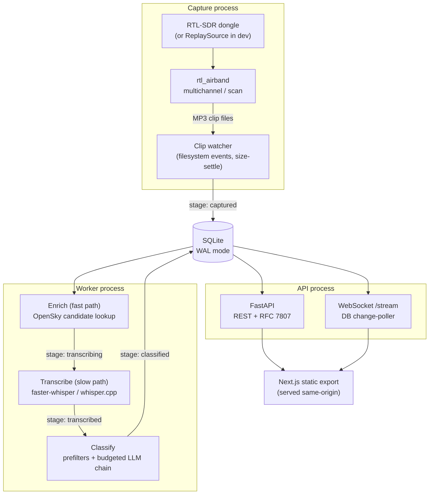

# Architecture

skywatch is a receive-only aviation monitoring station for a single RTL-SDR
dongle. It listens to VHF airband voice, turns each transmission into a
clip, transcribes and classifies it, attaches probable aircraft, and serves
the result through an API and a web dashboard. This document explains how
the pieces fit together and, more importantly, why each one is shaped the
way it is — the constraints that made the obvious design wrong, and the
trade-off that was chosen instead.

## System overview

Three long-running processes share one SQLite database and nothing else:

- **Capture** — a supervised `rtl_airband` instance (or, in development, a
  fixture replay source) that writes MP3 clips to disk.
- **Worker** — watches the recordings directory, ingests new clips, and
  drives each one through enrichment, transcription, and classification.
- **API** — a FastAPI server that reads the same database, serves it over
  REST and a WebSocket, and hosts the compiled dashboard as static files.

None of the three talk to each other directly. The database is the only
contract between them, which is what lets each one be started, stopped, and
reasoned about independently — and what lets the API poll for changes
instead of needing a message bus.



The rest of this document walks the diagram left to right: capture, the
pipeline's ordering decisions, transcription, classification, enrichment
and the live Sky view, storage, the API and dashboard, and finally how it
is actually deployed.

## Capture

### Multichannel vs. scan

`rtl_airband` can run in two modes, both already implemented and switchable
per-station in `config/config.yaml` (`capture.mode`):

- **Multichannel** demodulates every active frequency at once, provided
  they all fit inside one tuner window. At the station's 2.56 Msps sample
  rate that window is about 2.4 MHz once the rolled-off edges are
  discarded (`USABLE_WINDOW_MHZ` in `capture/validate.py`). This is the
  default, and stays the default: nothing is missed while the receiver is
  parked elsewhere, because it isn't parked anywhere — it watches the whole
  window continuously.
- **Scan** hops across an arbitrary list of frequencies that don't fit one
  window (a nearby airfield and a distant one, say). The cost is inherent
  rather than a bug: while parked on one frequency the receiver is deaf to
  every other one, so simultaneous transmissions are lost and a clip can
  start mid-word. It buys frequency coverage at the cost of completeness.

When an operator tries to activate a frequency that would break the
multichannel window, the API does not silently drop into scan mode or
refuse outright — it computes the largest still-fitting subset and reports
back which frequencies would need to move and what centre frequency would
work, so the choice stays with whoever is holding the radio.

### Why there is no hot retune

Changing which frequencies are recorded — or changing gain, squelch, or
frequency trim from the tuning bench — takes the station off the air for a
few seconds. `rtl_airband` has no interface for reconfiguring a running
instance's channel set or radio parameters in place; the only way to change
what it demodulates is to hand it a new configuration file and start it
again. Rather than working around that with a more complex always-on
IQ-fan-out chain (considered and rejected — see `EXTENSIONS.md`'s
"Permanent IQ fan-out" note, on complexity-to-benefit grounds), skywatch
accepts the constraint: every plan or tuning change **regenerates**
`data/rtl_airband.conf` from the frequency table and the applied tuning
values (`capture/conf_render.py`, `capture/live.py`), then stops and
restarts the process (or, under launchd, `kickstart -k`s the service).
Every API response that triggers this says so plainly, because it is a
real, if brief, interruption to what's being recorded.

### The `CaptureSource` abstraction

Both the live radio and a fixture-driven development mode implement the
same three-method protocol — `start`, `stop`, `status` — defined in
`capture/source.py`:

```python
class CaptureSource(Protocol):
    def start(self) -> None: ...
    def stop(self) -> None: ...
    def status(self) -> SourceStatus: ...
```

`LiveSDRSource` renders the conf, checks a dongle is actually attached (by
parsing `rtl_test -t`), and supervises `rtl_airband` either as a child
process or via `launchctl kickstart` — selected by `capture.supervisor`, so
the same code works for a developer running the binary directly and for the
deployed launchd topology. `ReplaySource` instead copies fixture MP3s into
the recordings directory on a timer, using the exact filename convention
(`capture/filenames.py`) `rtl_airband` produces — dated subdirectories, UTC
start time and frequency encoded in the name — so every downstream stage,
including the watcher's filename parser, treats a replayed clip identically
to a captured one. `config/config.yaml.example` ships with `capture.source:
replay` as the default: the entire pipeline, and every test in the suite,
runs with no RTL-SDR hardware attached. `capture.source: live` is a
one-line change for a station with a real dongle.

## The pipeline's ordering trade-off

A captured clip needs three things done to it: an enrichment lookup (which
aircraft was probably transmitting), a transcript (what was said), and a
classification (is it worth a listen). The obvious order is enrich after
classify, so cheap prefilters and a budgeted LLM can decide what's worth
the enrichment call. skywatch does the opposite, and the reason is a race
between two very different clocks:

- **OpenSky's historical query only looks back about one hour.** A state
  vector lookup for a timestamp more than an hour old simply returns
  nothing.
- **Transcription is slower than real time on the production hardware.**
  On a busy day the ASR backlog can run well behind the clips arriving,
  because it is strictly sequential (see the ASR section below).

If enrichment waited until after a clip was transcribed and classified, a
busy day's backlog would routinely push clips past OpenSky's one-hour
window before enrichment ever ran — the aircraft that was actually
overhead would no longer be queryable, and every clip behind it in the
backlog would silently lose its probable-aircraft match. So the worker
splits the stage machine into two logical paths that share one column on
the `recordings` row (`pipeline/worker.py`):

- **Fast path — enrichment.** Every clip is enriched immediately after
  capture, independent of how deep the transcription backlog is. A failure
  here is retried briefly and then simply recorded; it never blocks the
  slow path, because a missing aircraft match is a worse outcome than a
  missing transcript, not a blocking one.
- **Slow path — transcription then classification.** Transcription runs
  strictly one clip at a time (ASR is the actual bottleneck), followed by
  budgeted classification once a transcript exists.

The state machine is `captured → enriching → transcribing → transcribed →
classifying → classified`, with `failed_*` side-states for each stage. A
clip that fails enrichment after its retry budget is exhausted is moved
forward to `transcribing` anyway — enrichment never gets to hold up the
rest of the pipeline. This ordering is the single most load-bearing
decision in the pipeline: it exists because the two clocks it's racing
(a one-hour data window, and a backlog that can run for hours) point in
opposite directions, and the data window loses first if you get the order
wrong.

## Automatic speech recognition

The default engine is `faster-whisper` (a CTranslate2 build of Whisper),
running the `base.en` model at `int8` compute precision — a size and
precision chosen to fit the reference production floor of a 2015 dual-core
Intel Mac with 8 GB of RAM, where a larger model is not viable at
real-time-adjacent speed. `whisper.cpp` is the fallback engine
(`asr.engine: whisper_cpp`) for machines where the CTranslate2 wheel isn't
available, wrapping the `whisper-cli` binary as a subprocess and parsing
its JSON output.

Both engines implement the same `ASREngine` protocol (`providers/asr/base.py`),
accepting optional `hotwords` and an `initial_prompt` to bias the
recogniser towards words it's likely to hear. skywatch uses this for
**callsign hotword boosting**: before transcribing a clip, the worker reads
whatever probable-aircraft candidates enrichment already found for it
(`pipeline/stages/transcribe.py::callsign_hotwords`), converts each ICAO
callsign to its spoken radiotelephony form (e.g. `BAW472` → "Speedbird
472", via the airline's radio callsign and phonetic digits), and passes the
resulting phrases as hotwords. This is only possible because enrichment
already ran — another consequence of the enrich-before-transcribe ordering
above, and a second, independent reason it pays for itself.

`faster-whisper`'s underlying model natively accepts a hotwords string and
an initial prompt, so the boost reaches the recogniser directly.
`whisper.cpp` has no equivalent hotword-biasing facility in its CLI output
path; `WhisperCppEngine.transcribe` accepts the same `hotwords` and
`initial_prompt` parameters as the other engine (so the calling stage never
has to special-case which engine is active) but simply ignores them. A
station running the whisper.cpp fallback gets a working transcript, just
without the callsign-aware accuracy bump.

## Classification cascade and budget

Every clip is classified in two layers, and the ordering rule between them
is one-directional: **the LLM layer can only upgrade a clip's interest
level, never downgrade one the deterministic layer already flagged**
(`pipeline/stages/classify.py`, `pipeline/prefilters.py`). A false positive
from the deterministic layer is permanent; a false negative from an LLM
call that judged a genuinely flagged clip "routine" is overridden.

**Prefilters** run on every clip, before any network call, and cost
nothing:

- **Keyword flags** — a curated list of distress and urgency phrasings
  (`mayday`, `pan pan`, `engine failure`, emergency squawk codes spoken as
  words, and similar) matched against the transcript. The list is
  deliberately conservative: a bare word with routine company-name uses
  (`fuel`, `pan`) is excluded in favour of its distress phrasing, because a
  false positive here can never be taken back.
- **Guard-frequency flag** — any transmission on the international
  emergency frequency (121.5 MHz) is flagged, because real traffic there is
  itself unusual regardless of content.
- **Duration-outlier flag** — a clip that runs far longer than the recent
  history for its own channel (rolling mean plus a configurable multiple of
  standard deviation, `pipeline/prefilters.py::duration_is_outlier`) is
  flagged, on the basis that unusually long transmissions on a normally
  terse channel are themselves a signal.
- **Interesting-aircraft flag** — a clip whose best-ranked probable
  aircraft carries a plane-alert category (military, government, historic)
  is flagged.

Clips under a short duration floor, or with an empty transcript, never
reach an LLM call at all — they're classified by prefilters alone, since
there's nothing for a language model to usefully judge.

**Watch phrases** sit alongside the built-in keyword list as an
owner-editable safety net (`pipeline/watch_phrases.py`): the station ships
with the built-in distress phrasings seeded as the default watch-phrase
list, stored in the settings table, and an operator can add their own
words to catch (a local airfield name, a squawk they personally care
about) from the dashboard. A malformed or corrupted setting value falls
back to the built-in defaults rather than silencing them — a misedit can
only add coverage, never remove the deterministic floor.

**The LLM layer** is a configurable provider chain — `llm.provider` plus an
ordered `llm.fallback` list, defaulting to Gemini with Groq then no LLM as
fallbacks — tried in order until one returns a parseable verdict or the
chain is exhausted. Every call is metered per provider per day against
`llm.daily_call_cap` (900 by default), tracked in a dedicated `api_usage`
table. The budget check and the call-accounting increment happen in their
own committed transaction *before* the network request fires, specifically
so that a real API call that was actually spent is always counted even if
the classification transaction around it later rolls back — an uncounted
spend is how a daily cap gets silently blown by retries. When every
provider in the chain is out of budget for the day, the clip is not left
unclassified: the prefilter verdict is stored immediately with status
`deferred`, and a separate backfill pass upgrades it to a real LLM verdict
once budget resets, without duplicating the row. Prefilter-flagged clips
are also classified before routine-looking ones within the same pass
(`_classify_pass`'s candidate sort), so a scarce daily budget is spent on
the clips most likely to matter first.

## Enrichment and the live Sky view

These are two different features built on the same flight-data domain, and
they deliberately use different data sources for different reasons.

**Per-clip enrichment** (`providers/flightdata/opensky.py`) answers "which
aircraft was probably transmitting this clip" by querying OpenSky's
`/states/all` endpoint for a bounding box around the receiver at the clip's
capture time. Authentication is OAuth2 client-credentials, with access
tokens refreshed just before their ~30-minute expiry. Every bounding-box
query costs one credit against a daily allowance
(`enrichment.daily_credit_cap`, 3000 by default), so lookups are cached in
fixed-width time buckets (`enrichment.bucket_seconds`, 30 by default) —
every clip captured within the same bucket window shares one query rather
than paying for its own. Once state vectors come back, candidates are
ranked by distance and plausibility, and each one is joined against the
vendored OpenFlights airline directory (for callsign → airline resolution)
and, when present, the locally downloaded OpenSky aircraft-identity CSV and
the plane-alert database, to attach a registration, aircraft type,
operator, and — for notable airframes — a curated category badge.

**The Sky view's live map** answers a different question — "what's
overhead right now" — and needs a different shape of trade-off. It cannot
reuse the per-clip enrichment client as its sole source, because that
client's OpenSky credit budget is small and shared with every clip's
enrichment lookup, while a live map wants to be polled continuously by an
open dashboard tab. So the Sky source chain (`providers/flightdata/sky.py`)
tries three **keyless**, non-commercial community aggregators in order —
airplanes.live, adsb.lol, adsb.fi — each of which normalizes to the same
`SkyAircraft` shape, and falls through to OpenSky's bounding-box endpoint
only as a last resort, itself gated behind the same daily credit budget so
a quiet map never starves per-clip enrichment of its own credits. A
per-source failure (timeout, HTTP error, unparseable body) falls through to
the next leg rather than raising; when every leg is down, the map returns
an honest empty result. None of this needs a second RTL-SDR receiver: the
positions come from other people's ADS-B receivers aggregated over the
internet, not from anything this station's own dongle hears — the dongle
only ever listens to voice.

The live map is fused with what the station has actually heard: a
short-lived cache (8 seconds, shared across every connected dashboard
tab so multiple browsers polling the same station don't multiply upstream
requests) joins the current live aircraft against recent `aircraft_matches`
rows, so an aircraft the station has heard recently is visually
distinguished and clickable through to the clips it was heard on
(`api/services/sky.py`).

### Why Leaflet, not a WebGL map

The map is built on Leaflet with raster OpenStreetMap tiles, not a
WebGL-based renderer. The production host is the reference 2015 Intel
laptop's integrated GPU, which is exactly the environment a heavier WebGL
map stack is least suited to; a raster tile layer has no such requirement.
Dark mode does not use a separately-hosted dark basemap — CARTO's
pre-styled dark tiles were considered and rejected because their basemap
terms weren't a clean fit for the station's receive-only, personal-use
posture, unlike OSM's tile usage policy. Instead, dark mode applies a CSS
filter (`invert(1) hue-rotate(180deg) brightness(0.85) contrast(0.9)
saturate(0.6)`) to the identical OSM raster tiles the light theme uses, so
attribution and licensing stay the same in both themes and the map needs
no second tile source to maintain.

## Storage

The three processes share one SQLite database opened in **WAL mode**
(`PRAGMA journal_mode=WAL`, plus `foreign_keys=ON`, a 5-second busy
timeout, and `synchronous=NORMAL`), which is what makes concurrent access
from capture's watcher, the worker, and the API safe without a separate
database server: WAL lets readers proceed without blocking on a writer, and
the busy timeout absorbs the brief lock contention that remains.

### The stage state machine

A `Recording` row's `stage` column is the pipeline's entire coordination
mechanism (`db/enums.py::RecordingStage`): `captured → enriching →
transcribing → transcribed → classifying → classified`, with `failed_enrich`
/ `failed_transcribe` / `failed_classify` side-states. A stage claim is
committed to the database *before* the corresponding work starts, so a
crash mid-stage leaves a row visibly stuck in an in-flight state
(`enriching` or `classifying`) rather than silently lost. On startup,
`reset_in_flight` rolls any such row back to its pre-claim queue state
(`enriching → captured`, `classifying → transcribed`), and every stage is
written to be idempotent on re-run — the worker can be killed and restarted
at any point without a clip being double-processed or dropped.

### Search: FTS5 and the `q` mini-grammar

Transcript search runs on an **external-content FTS5** virtual table over
`transcripts.text` (`db/fts.py`) — external-content because the indexed
text stays in the `transcripts` table itself and the FTS5 table only holds
the index, kept in sync by insert/update/delete triggers rather than a
duplicated copy of every transcript. FTS5 is optional at the SQLite build
level; the migration only creates the index when the running SQLite has it
compiled in, and search falls back to a plain `LIKE` scan otherwise
(`db/fts.py::search_available`).

The dashboard's search box is a single string, parsed by a small grammar
(`api/services/search.py::parse_search`) that lets free text and a handful
of structured filters share one field: `freq:<mhz-or-label>`,
`callsign:<x>`, the bare keyword `interesting`, and `before:`/`after:`
ISO-date bounds, alongside quoted phrases and plain words that become the
full-text query. Anything that doesn't parse as a recognised filter — a
malformed date, an empty value, an unknown key — is treated as ordinary
search text rather than raising an error, so a typo in the search box never
produces a hard failure.

### Retention

Audio and metadata are retained on different schedules, deliberately.
Routine clips have their **audio file** deleted after a configurable window
(`retention.routine_audio_days`, 14 days by default) — but the database row
survives forever, so a clip's transcript, classification, and aircraft
match stay browsable with no playback. A clip is only ever eligible for
audio pruning if its *latest* classification says routine; a later
reclassification to interesting protects the audio even if an earlier
verdict said otherwise, and anything ever marked interesting is never
pruned. Separately, when free disk space drops below a configured floor,
the worker pauses capture outright (rather than continuing to fill the
disk) and surfaces the pause through the settings table so the API can
report it; capture resumes on its own once space is freed.

## API and dashboard

### Error and link conventions

Every successful resource response carries a HAL-style `_links` object —
`self` plus related resources and whichever actions are currently available
on that resource (`api/schemas.py::HALModel`) — so a client can navigate
the API by following links rather than constructing URLs by hand. Every
error response, in turn, shares one shape: an RFC 7807 problem detail
(`application/problem+json`) with `title`/`status`/`detail` plus a stable
machine-readable `code` the dashboard can switch on
(`api/errors.py::ProblemDetail`). A handful of problems carry additive
extension fields on top of that shape — a tuner-window conflict, for
instance, returns which frequencies would need to move and what centre
frequency would fit instead of just refusing.

### Live updates: a database-polling WebSocket

`WS /stream` sends one envelope shape — `{"type": <event>, "payload":
<object>}` — for `recording.new`, `recording.updated`, `status.changed`,
and, only while a deep tune session is active, `spectrum.frame` and
`deep_tune.state`. The stream is send-only; anything a client sends over it
is drained and ignored. Notably, the worker process that actually writes
these rows never notifies anyone directly — it just commits to SQLite. The
API instead polls the database on a short interval (`api/ws.py`) and turns
new or changed rows into stream events, using a composite
`(updated_at, primary_key)` watermark so that two rows sharing the same
timestamp within one poll tick are never skipped. This is cheap under
SQLite WAL at station traffic rates, and it keeps the worker↔API contract
purely database-shaped: the worker never needs to know the API exists, and
a second API instance could poll the same database with no coordination
required.

### The dashboard is served same-origin

The dashboard is a Next.js app built as a static export (`web/out`), which
FastAPI mounts directly as static files at the application root
(`api/app.py::create_app`, `StaticFiles(..., html=True)`). In normal use
there is no separate frontend server and no cross-origin request between
dashboard and API — the same process that answers `/recordings` also
serves `index.html`. CORS is nonetheless left permissive (`allow_origins:
["*"]`), which exists for dashboard development servers running on other
local ports; it isn't a security boundary, because the API has none — see
Deployment below.

### Dual-theme design system

The dashboard defines two deliberately different themes rather than one
theme and its inverse: light is styled as a "warm listening-post" (paper
backgrounds, ink text, a single signal-amber accent reserved for
"interesting"), and dark as a "flight-deck" (near-black warm panels,
phosphor amber/green data accents) — both built from OKLCH design tokens
and both meeting WCAG AA contrast. The tuning bench and Deep Tune's
spectrum scope have their own token families (LCD-window backlight colours,
scope trace and grid colours) so those instrument-styled panels read as
part of the same family as the rest of the dashboard in both themes. A
large-print mode is a separate, persisted setting that scales type size
across every screen without altering the theme.

### The tuning bench

The tuning bench is the dashboard's live control surface for gain, squelch,
and frequency trim, backed by two different data paths depending on what
it's showing. Its **live signal meters** read `rtl_airband`'s own
statistics file, which the process rewrites roughly every 15 seconds in a
loose Prometheus-like text format even while squelch is closed
(`capture/stats.py`) — the station's only always-on meter source,
independent of whether anything is currently being recorded. **Deep Tune**,
the bench's spectrum scope, is a different mechanism entirely: because one
RTL-SDR dongle has exactly one USB claimant, a live spectrum view cannot
run alongside `rtl_airband`, so opening Deep Tune stops capture outright,
opens the device directly through `pyrtlsdr`, and streams averaged spectrum
frames over the event stream a few times a second
(`api/services/deep_tune.py`). The server, not the browser, owns the
session's lifecycle: it ends itself after ten minutes of inactivity (with a
warning event first), after losing every connected stream client for about
thirty seconds, or on a clean exit — and capture restarts automatically on
every one of those paths, so a dropped dashboard tab can never strand the
station off the air.

### Clips and Sky are two-way linked

A clip whose probable aircraft is still overhead carries an "overhead now"
tag that deep-links straight to that aircraft on the Sky map; the Sky map,
in turn, highlights any aircraft the station has heard recently and links
back to the clips it was heard on. Both directions are driven by the same
clip-fusion join described above (`api/services/sky.py`), so the two views
share one notion of "heard recently" rather than maintaining it twice.

## Deployment and portability

In production, the three processes run as separate **launchd** services
(`deploy/launchd/*.plist`), each restarted automatically on crash. The
`rtl_airband` service is additionally gated on the *existence* of a
rendered configuration file (`KeepAlive.PathState`): on a station still
running in replay mode, no conf has ever been written, so the service stays
quietly stopped instead of crash-looping against a config that doesn't
exist yet. `scripts/bootstrap.sh` also disables system sleep while the
laptop is on AC power, since the station is designed to run continuously
with the lid closed, on mains power.

The reference production host — a 2015 dual-core Intel MacBook Pro with
8 GB of RAM — is treated as a hard performance floor throughout the
codebase, not an afterthought: it is why the default ASR model is `base.en`
at `int8` rather than a larger, more accurate model; it is why transcription
is strictly sequential rather than parallelised across clips; and it is why
the dashboard's map uses raster tiles rather than a WebGL renderer.
Development happens on newer Apple Silicon hardware, so the codebase avoids
hardcoding CPU architecture or Homebrew path prefixes anywhere in its
tooling.

The API is **unauthenticated by design**. It is meant to be reachable only
from a private network — a home LAN, or a private overlay network such as
Tailscale for remote access — and must never be exposed to the public
internet; nothing in the request path enforces this, so it is a deployment
posture rather than a technical guarantee. That posture matches the
station's legal one: skywatch is receive-only software (it has no
transmit path at all) built for personal, private listening. In the United
Kingdom, the Wireless Telegraphy Act 2006 makes it an offence to disclose
the contents of radio transmissions not intended for you, or to act on
them — so the dashboard, the API, and the weekly digest are all built as
tools for a single household's own listening, not for republishing what
was heard.

## Key trade-offs

| Decision | What it optimises for | What it gives up |
|---|---|---|
| Enrich before transcribe/classify | Aircraft matches that stay inside OpenSky's ~1-hour historical window, regardless of ASR backlog depth | A simpler, single-path pipeline where enrichment could lean on a settled transcript |
| Full restart on any plan/tuning change | A simple, always-correct capture configuration (regenerate, don't patch) | A brief (~seconds) on-air gap on every frequency or gain/squelch change |
| Multichannel as the default capture mode | Zero missed concurrent transmissions within one tuner window | Coverage is capped at ~2.4 MHz of simultaneous spectrum; wider spreads need scan mode or a second dongle |
| `int8` `base.en` faster-whisper by default | Runs acceptably on the 2015 dual-core / 8 GB production floor | Materially worse word accuracy than a larger or ATC-finetuned model |
| Strictly sequential transcription | Predictable resource use on constrained hardware; no contention between concurrent ASR jobs | Backlogs form and drain over hours on busy days rather than in near-real-time |
| Prefilters can only upgrade, never downgrade | A false negative from the LLM can never silence a genuine distress keyword | A prefilter false positive is permanent and un-overridable |
| Deferred backfill on LLM budget exhaustion | Every clip gets a final verdict eventually, without ever exceeding the daily call cap | An interesting clip classified late in a busy day may sit as "deferred" for a while |
| Keyless community aggregators for the live map, OpenSky as last resort | A continuously-pollable live map that doesn't compete with per-clip enrichment for OpenSky credits | Reliant on three third-party services' uptime and rate limits, none of which are SLA-backed |
| Leaflet + CSS-filtered OSM raster tiles, not WebGL | Runs on the production host's integrated GPU; one tile source serves both themes under one licence | No 3D/vector-tile styling flexibility; dark mode is a filter, not a bespoke basemap |
| SQLite in WAL mode as the only cross-process contract | No message bus or database server to operate; each process fails independently | Three-process coordination is entirely stage-column and polling based, not event-pushed |
| Unauthenticated API, private-network-only posture | Zero auth complexity for a single-household tool | The API and dashboard must never be exposed to the public internet |
