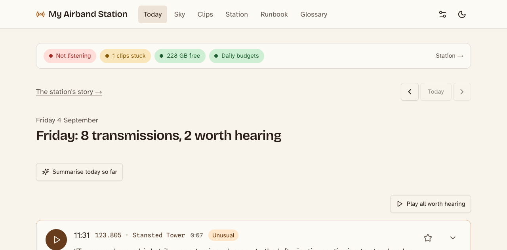
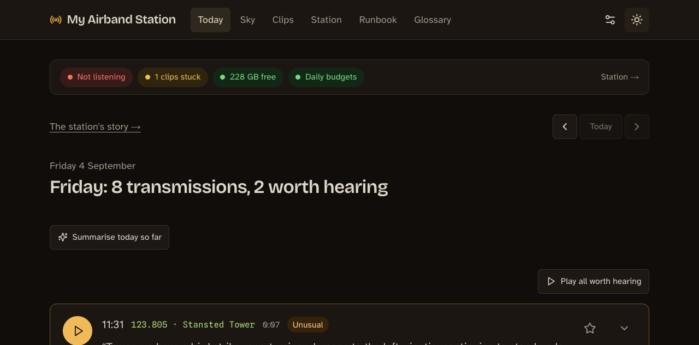
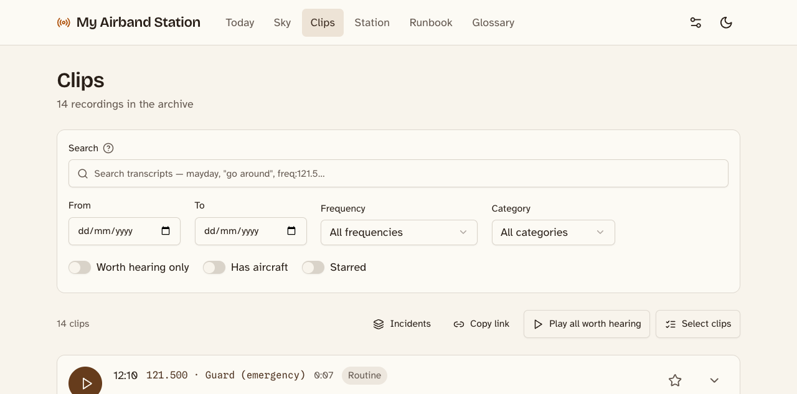
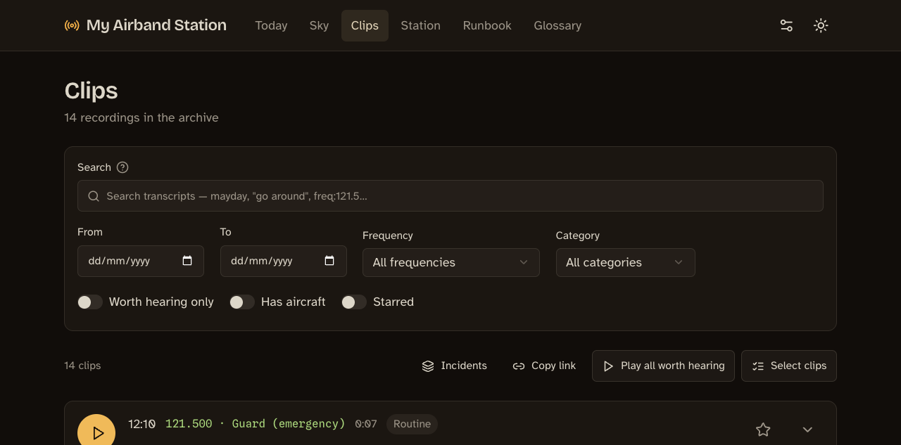
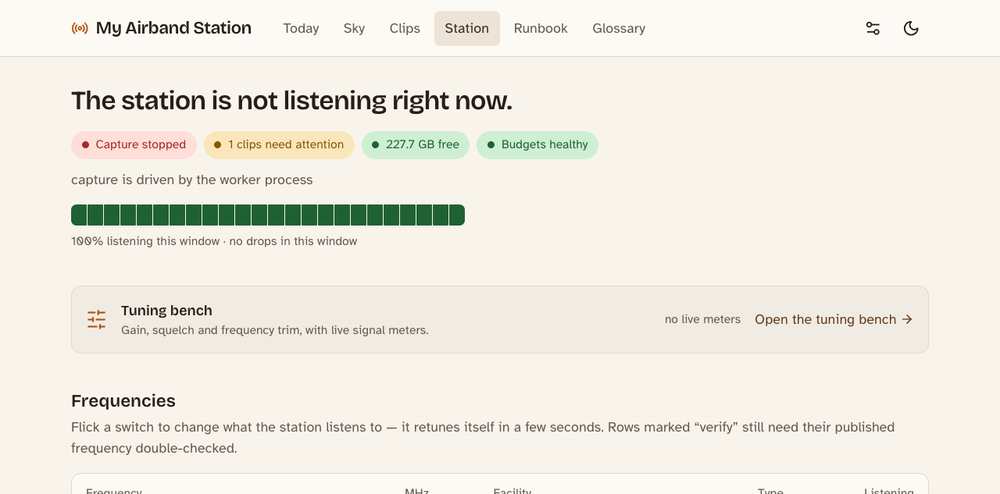
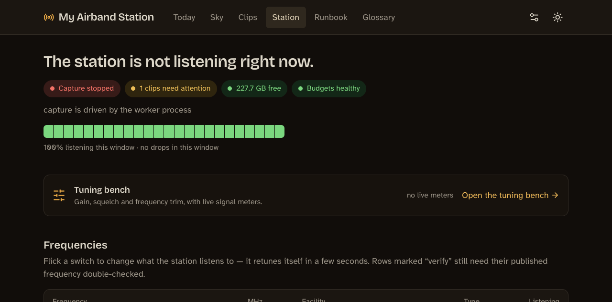
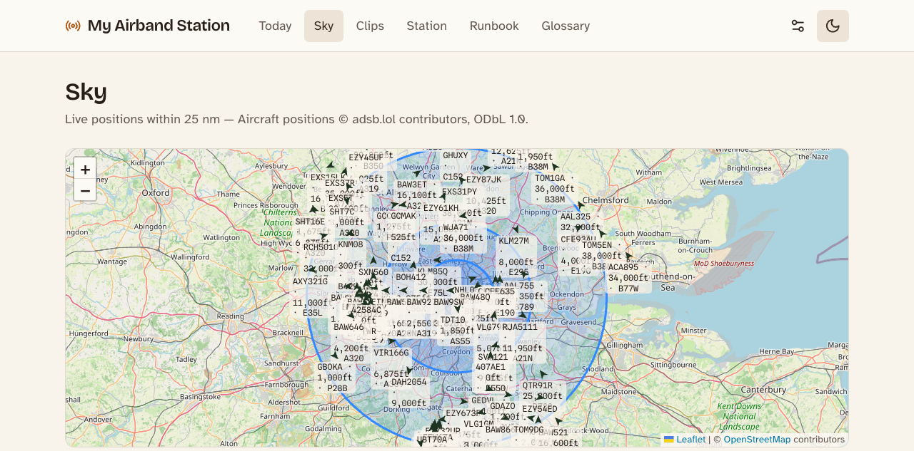
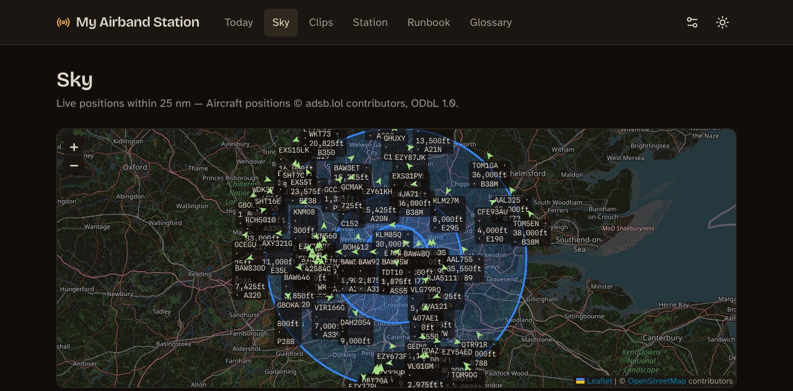
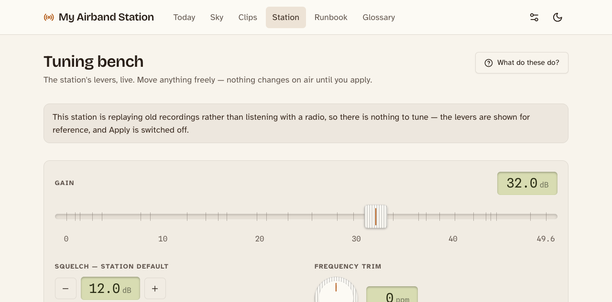
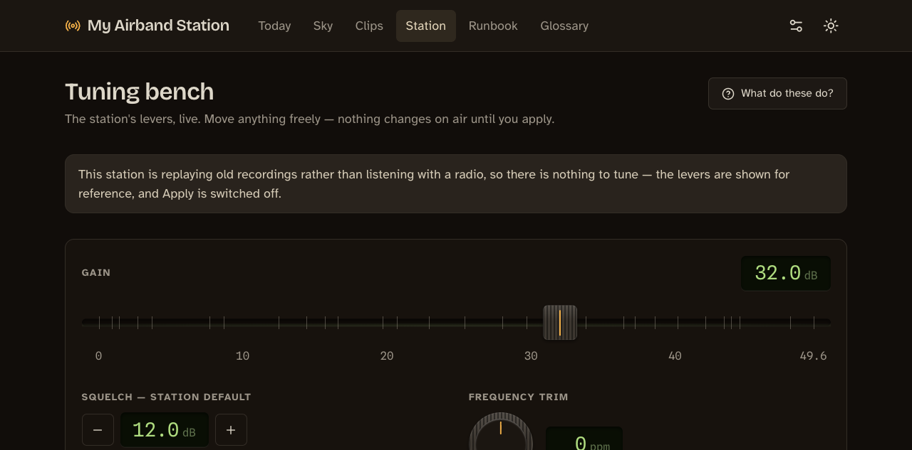

# Screenshots

The dashboard ships two deliberately different themes rather than one theme
and its inverse: a warm "listening post" in light mode and a "flight deck"
in dark. Each view is shown in both.

All captures below use seeded example data and the repository's placeholder
station location.

## Today

The landing view: the day's activity, anything flagged as interesting, and
the station's current health at a glance.

| Light | Dark |
|---|---|
|  |  |

## Clips

The full recording archive, with transcript search, filtering, and the
playback queue.

| Light | Dark |
|---|---|
|  |  |

## Station

Frequency plan management, capture status, and the rolling health history.

| Light | Dark |
|---|---|
|  |  |

## Sky

The live map of aircraft currently in range, fused with what the station
has actually heard.

| Light | Dark |
|---|---|
|  |  |

## Tuning bench

The live control surface for gain, squelch, and frequency trim, with signal
meters fed from the capture process's own statistics.

| Light | Dark |
|---|---|
|  |  |
